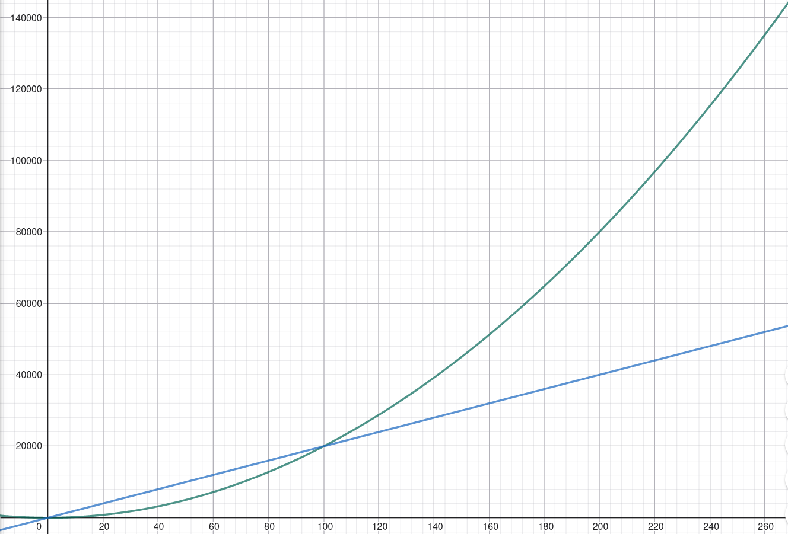
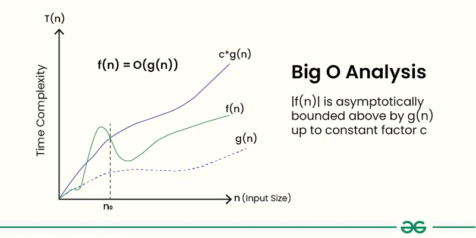
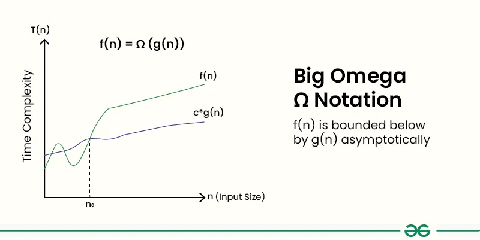
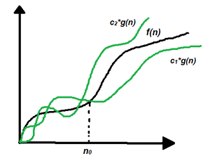

## Оценка и сложност на алгоритми

За всеки алгоритъм, който досега сме разглеждали, човек може по някакъв начин да си направи интуитивна преценка (или поне да предположи) колко време отнеме неговото изпълнение. Обаче теоритичните компютърните науки имат нужда от **точно и ясно** дефиниран апарат за изследването им. Поради това тази тема не бива да се прескача, за да може човек да си изгради точна и ясна преценка за коректността и бързодействието на един алгоритм. Дефинициите и своиствата, които предстои да видите, ще са неразделна част от курса ни занапред.

Като за начало, нека вземем следния фрагмент код:

~~~.cpp
1. int n = 100;
2. int sum = 0;

3. for(int i = 0; i < n; ++i)
4.  for(int j = 0; j < n; ++j)
5.    sum++;
~~~

Както виждате, това е стандартен вложен цикъл, но не това ни интересува. Нека замерим времето за изпълнение на кода спрямо размера на входа **n** и да видим дали ще излезе нещо интересно?

----

| Размер на входа | Време за изпълнение | 
|----------------:|--------------------:|
| 100             | ~16 μs              |
| 1 000           | ~467 μs             |
| 10 000          | ~46 162 μs          |
| 100 000         | ~4 376 769 μs       |

От експерименталните данни (за вход n >= 1000) можем да видим следното:

$$
\frac{46162\ \mu s}{467\ \mu s} \approx 98.84
\qquad
\frac{4376769\ \mu s}{46162\ \mu s} \approx 94.82
$$

При промяна на входа с фактор $10x$, времето за изпълнение се променя с фактор $100x$. Следователно времето за изпълнение на кода се увеличава квадратно пропорционално на размера на входа, което е много интересно наблюдение!

## Аналитичен анализ

**Ред 1**

```cpp
int n = 100;
```

Тук имаме инициализицаия на променлива, това отнема някакво определено време да се вземе от стековата памет на програмата, но ще го погледнем абстрактно и ще кажем, че отнеме $a$ на брой константно време, зависещо от **ОС**, **памет** и т.н...

**Ред 2**

```cpp
int sum = 0;
```

Отново имаме инициализация на променлива, която отнема константно време. Нека я означим с $b$.

**Ред 3**

```cpp
for (int i = 0; i < n; ++i)
```

Тук имаме три операции:

* Инициализация на променливата $i$ — нека отнема време $c$.
* Сравнение $i < n$ — нека отнема време $d$.
* Инкрементиране на $i$ — нека отнема време $e$.

Инициализацията на $i$ се извършва само веднъж. Сравнението и инкрементирането се извършват приблизително $n$ пъти.

**Ред 4**

```cpp
for (int j = 0; j < n; ++j)
```

Този цикъл се намира във вътрешността на първия цикъл. Следователно той се изпълнява $n$ пъти — по веднъж за всяка итерация на външния цикъл.

За всяко изпълнение на външния цикъл имаме:

* Инициализация на $j$ — време $f$.
* Сравнение $j < n$ — време $g$.
* Инкрементиране на $j$ — време $h$.

**Общ брой операции**

$$
T(n) = a + b + c + n(d + e + f) + n^2(g + h)
$$

Групираме константите:

$$
a + b + c = i
$$

$$
d + e + f = j
$$

$$
g + h = k
$$

Тогава общото време за изпълнение може да се запише като:

$$
T(n) = i + n \cdot j + n^2 \cdot k
$$

## Извод

Константите, които получихме - $i$, $j$, $k$ са важни за правилната аналитична оценка на кода, но могат да бъдат пропуснати, тъй като зависят от представянето на данните на ниво хардуер и не са строго определящи за нашия анализ. 

Нещо повече даже, можем да прескочим изцяло $$i + n \cdot j$$, тъй като ако разгледаме $n$ да клони към безкрайност, от един момент нататък времето за изпълнение ще се определя изцяло и само от едночлена с най-висока степен, а именно $$n^2$$. 

Така нашата финална аналитична оценка за времето на изпълнение на този фрагмент код е:

$$
T(n) = n^2
$$

## Пример - кога константите имат значение?

Нека разгледаме два алгоритъма $A_{1}$ и $A_{2}$, които решават конкретна задата, със сложност съответно:

$$f(n) = 2 \cdot n^2$$
$$g(n) = 200 \cdot n$$

Ако използваме предходната логика и игнорираме изцяло константите ще се окаже, че $A_{2}$ е по-добър от от $A_{1}$ за всеки вход $n$, което изобщо не е вярно, тъй като за n < 100 $A_{1}$ е явно по-бърз. Обаче, колкото повече увеличаваме $n$, толкова по-явна става разликата между двете функции. В случая ще казваме, че $A_{2}$ е асимптотично по-бърз алгоритъм от $A_{1}$.  
  
$A_{1}$ ще наричаме **квадратичен**  
$A_{2}$ ще наричаме **линеен**  

<p align="center">
   
</p>

## Асимптотични нотации

В курса по **СДП** когато разглеждаме сложност на алгоритъм ще се интересуваме как се държи той при достатъчно голям размер на входните данни $n$. Затова когато оценяваме алгоритми, ще разглеждаме $n$ да клони към безкрайност. Функциите, които ще разгледаме ще бъдат от вида f : N → N, където N ще е някакво множество дали естествените числа, реалните или техни подмножества.

Когато групираме функциите ще използваме следните нотации:

----

$O(F(N))$

Def: $$O(F(n)) = \{f(n) \mid \exists c > 0,\ \exists n_0(c):\ \forall n > n_0:\ 0 \leq f(n) \leq c \cdot F(n)\}$$

Това са всички тези функции $f(n)$, за които от един момент нататък $n_{0}$, съществува константа $c$, такава че горново неравенство да е изпълнено. Или с други думи, това са вискчки функции растящи не **по-бързо** от $F(N)$.

<p align="center">
   
</p>

----

$\Omega(F(N))$

Def: $$\Omega(F(n)) = \{f(n) \mid \exists c > 0,\ \exists n_0 > 0:\ \forall n > n_0:\ f(n) \geq c \cdot F(n) \geq 0\}$$

Това са всички функции, които растат не **по-бавно** от $F(N)$

<p align="center">
   
</p>

----

$\Theta(F(n))$

Def: $$\Theta(F(n)) = \{f(n) \mid \exists c_1 > 0,\ \exists c_2 > 0,\ \exists n_0(c_1,c_2):\ \forall n \geq n_0:\ 0 \leq c_1 \cdot F(n) \leq f(n) \leq c_2 \cdot F(n)\}$$

Това е сечението на горните две нотации: $$\Theta(F(n)) = O(F(n)) \cap \Omega(F(n))$$. Това са всички функции, за които съществуват константи $c_{1}$ и $c_{2}$, такива че можем да заключим $f(n)$ между $c_{1} \cdot F(n)$ и  $c_{2} \cdot F(n)$. Или това са просто функциите, които растат точно толкова бързо, колкото и $F(n)$.

<p align="center">
   
</p>

----

Следващите две не са толкова често използвани, но е добре да се споменат за пълнота:

$o(F(N))$

Def: $$o(F(n)) = \{f(n) \mid \forall c > 0,\ \exists n_0(c):\ \forall n > n_0:\ 0 \leq f(n) < c \cdot F(n)\}$$

Това е строгият вариант на $O(F(N))$ и е просто $$o(F(N)) = O(F(N)) \backslash \Theta(F(N))$$. Това са всички функции по-бавни от $F(N)$.

$\omega(F(N))$

Def: $$\omega(F(n)) = \{f(n) \mid \forall c > 0,\ \exists n_0(c):\ \forall n > n_0:\ 0 \leq c \cdot F(n) < f(n)\}$$

Това е строгият вариант на $\Omega(F(N))$ и отново е $$\omega(F(N)) = \Omega(F(N)) \backslash \Theta(F(N))$$. Това са всички функции по-бързи от $F(N)$.

### Забележка
----

В курса ще се занимаваме почти изцяло само с **Big-O** нотацията, тъй като един алгоритъм най-често ни интересува колко добре се справя в най-лошият възможен случай, поради практически причини. 

$\Theta$ сложността обикновено се доказва технически трудно, а целта на курса ще бъде да е практически насочен и може би това ще е единственият и последен път когато ще видите тези нотации в целият им теоритичен и строг вид. 

$\Omega$ сложността е почти и изцяло практически, даже и теоритически безполезна, тъй като може да бъде фалшиво постигната. 

~~~.cpp
void very_hard_sort(int* arr, int size)
{
    if( size == 0) return;
    // ... сложна логика O(sqrt(n^2 + log5(cos(arcos(n^5))))
    // Въпреки това Омега сложността тук е константа, ако масива е празен нищо не се прави!!
}
~~~


## Нарастване на основните функции

Тук ви представям основните функции подредени по скорост на тяхното нарастване. Чрез тяхна помощ ще определяме сложността на алгоритмите в курса ни по СДП.

$$
c \lesssim \log n \lesssim n \lesssim n \log n \lesssim n^2 \lesssim n^3 \lesssim n^k \lesssim 2^n \lesssim n! \lesssim n^n
$$

<div align = "center">

| Функция | $n = 1$ | $n = 2$ | $n = 10$ | $n = 100$ | $n = 1000$ |
|:---:|---:|---:|---:|---:|---:|
| $5$ | $5$ | $5$ | $5$ | $5$ | $5$ |
| $\log n$ | $0$ | $1$ | $3,32$ | $6,64$ | $9,96$ |
| $n$ | $1$ | $2$ | $10$ | $100$ | $1000$ |
| $n \log n$ | $0$ | $2$ | $33,2$ | $664$ | $9966$ |
| $n^2$ | $1$ | $4$ | $100$ | $10000$ | $10^6$ |
| $n^3$ | $1$ | $8$ | $1000$ | $10^6$ | $10^9$ |
| $2^n$ | $2$ | $4$ | $1024$ | $10^{30}$ | $10^{300}$ |
| $n!$ | $1$ | $2$ | $3628800$ | $10^{157}$ | $10^{2567}$ |
| $n^n$ | $1$ | $4$ | $10^{10}$ | $10^{200}$ | $10^{3000}$ |

<div>Примерна табличка </div>

</div>

## Изчисляване сложност на алгоритми

Нека разгледаме някои основни своиства, с помощта на които ще можем да определяме сложността на алгоритми от тук насетне. Ще използваме стриктно Big-O нотацията спрямо размера на входа **n**. 

**Елементарни операции**

Елементарните операции са тези, които имат константна сложност $O(1)$. Обаче самото понятие "елементарна операция" е много абстрактно и ще се променя в зависимост от контекста. По дефиниция операция ще наричаме елементарна ако отнема едно и също време за колкото и да е голям вход, такива са събиране, изваждане както и умножение и деление, в повечето случаи (**Защо?**). Не считайте за елементарни операции функциите от стандартната библиотека или каквито и да е помощни функции, които използвате като pow, cos, sin, тъй като отвътре те не са елементарни!

**Последователни операции**

Това са операции които са една след друга и са независими. В този случай, сложността зависи от по-бавно растящата от тях:

$$f_1 + f_2 \in О(\max(f_1, f_2))$$

~~~.cpp
int a = cos(a) + foo(my_var); // e max(O(cos(a), O(foo(my_var))
~~~

**Композиция от операции**

Сложността на вложени операции, се пресмята като композиция от техните сложности, така че имам следното:

$$f_1 \cdot f_2 \in О(f_1 \cdot f_2)$$

**Условни кострукции**

При усолвни конструкции сложността се пресмята като се вземе най-бавно растящата функция от условията и съответните им блокове код:

~~~.cpp
if(cond())   foo();
else         bar();
~~~

$$T(n) \in O(max(condition, block1, block2))$$

**Цикли**

При цикли, както вече се разбрахме, тялото считаме за последователност от елементарни операции и следователно има константна сложност $O(1)$, независима от n. Така че цялостно сложността е $O(c \cdot n)$ или просто $O(n)$, тъй като можем да игнорираме константите.

~~~.cpp
int sum = 0;
for(int i = 0; i < n; ++i)
  sum++;
~~~

$$T(n) \in O(n)$$

## Задачи - определяне на сложност

**Задача 1.**

~~~.cpp
sum = 0;
for (i = 0; i < n*n; i++)
  sum+
~~~

<details>
<summary><b>Отговор</b></summary>
O(n^2)$$
</details>

**Задача 2.**

~~~.cpp
sum = 0;
for (i = 0; i < n; i++)
 for (j = 0; j < n; j++)
   if (i == j)
     for (k = 0; k < n; k++)
       sum++;
~~~

<details>
<summary><b>Отговор</b></summary>
Проверката ще се случи $n^2$ пъти, но ще успее само n, а най-вътрешният цикъл е линеен. Следователно имаме $O(n^2)$, като най-точно даже е $\Theta(n^2)$
</details>

**Задача 3.**

~~~.cpp
for (i = 0; i < n; i++)
 for (j = 0; j < n; j++)
   if (i == j)
     break;
~~~

<details>
<summary><b>Отговор</b></summary>
Вече е точно $O(n^2)$, тъй като нямаме допълнителния цикъл
</details>

**Задача 4.**

~~~.cpp
sum = 0;
for (i = 1; i <= n; i++)
 for (j = 1; j <= i*i; j++)
   sum++;
~~~

<details>
<summary><b>Отговор</b></summary>
Малко по-сложно, защото трябва да се знае формулата на гаус за квадрати: $$\sum_{k=1}^{n} k^2 = \frac{n(n+1)(2n+1)}{6}$$
  
Като вземам едночелана от най-висока степен имаме: $O(n^3)$
</details>

**Задача 5.**

~~~.cpp
sum = 0;
for (i = 0; i < n; i++)
 for (j = 0; j < i*i; j++)
   for (k = 0; k < j*j; k++)
     sum++;
~~~

<details>
<summary><b>Отговор</b></summary>​
Това е доста сложно и трябва да се "знаят" или да се изкарат формулите:
  
За най-вътрешния цикъл имаме:
От $$\sum_{j=0}^{m-1} j^2 ≈ m^3 / 3$$ следва $$\sum_{j=0}^{i^2 - 1} j^2 ≈ (i^2)^3 / 3 \in O(i^6)$$ 

Така за външния остава:
$$\sum_{i=0}^{n - 1} i^6 ≈ n^7 / 7$$
  
Финален отговор: $O(n^7)$
</details>

**Задача 6.**

~~~.cpp
for(sum = 0, h = 1; h < n; h *= 2)
 sum++;
~~~

<details>
<summary><b>Отговор</b></summary>​
$O(log(n))$
</details>

**Задача 7.**

~~~.cpp
unsigned fact(unsigned n)
{ if (n < 2)
 return 1;
 return n*fact(n-1);
}
~~~

<details>
<summary><b>Отговор</b></summary>​
Рекурсията е еквивалентна на един for цикъл: $O(n)$
</details>

## Задачи за упражнение

**Задача 1**  
Определете сложността:

~~~.cpp
for (i = 0; i < 2*n; i++)
 for (j = 0; j < 2*n; j++)
     if (i<j) for (k = 0; k < 2*n; k++) break;
~~~


**Задача 2**  
Определете сложността:

~~~.cpp
unsigned sum = 0;
for (i = 0; i < n; i++)
  for (j = i+1; j < i*i; j++) sum++;
~~~

**Задача 3**  
Определете сложността:

~~~.cpp
for (i = 0; i < n; i++)
 for (j = 0; j < n; j++)
   if (i==j)
     for (k = 0; k < n; k++) break;
~~~

**Задача 4**  
Определете сложността:

~~~.cpp
unsigned sum = 0;
for (i = 0; i < n; i++)
 for (j = 0; j < i*i; j++) sum++;
~~~


**Задача 5**  
Определете сложността:

~~~.cpp
int n = 10;
for (int i = 0; i<n; (n=i)++);
~~~

**Задача 6**  
Дадени са три алгоритъма със сложности съответно: 

* $$5 \cdot n^2 - 7 \cdot n + 13$$
* $$3 \cdot n^2 + 15 \cdot n + 100$$
* $$1000n$$
 
За всеки алгоритъм да се определи интервал от стойности n, за които той е по-бърз от другите два. 

