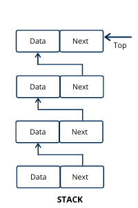

## Стек

Това е може би най-често използваната линейна структура от данни. При него операциите за включване и изключване на елемент се случват единствено и само върху посления (най-горния) елемент в колекцията. Този ред на действие се нарича **LIFO (Last in first out)** или на български - "последният влязъл е първият излязъл". 

Практическите потребности на стека са огромни. Като всяка машина, която притежава процесор, трябва да има стек за инструкциите си, тъй като те се трупат и изпълняват именно според LIFO принципа. Това важи и за нашия програмен стек, чрез който досега сме писали конзолни приложения.

## Последователна реализация

Тук стекът представлява просто динамичен масив, данните са подредени последователно в паметта, което значи че елемент i се намира на позиция: `address of first element + (sizeof(type) * i)`. Така че имаме масив с достъп за добавяне и премахване само на последния елемент. 

**Добавяне на елемент (push) - $O(1)$**
  
**Премахване на елемент (pop) - $O(1)$**

**Достъп до k-ти елемент - няма**

**Итерация - няма**

**Локалност - много добра (пространствена и времева)**

## Свързана реализация

Този подход за представяне на стек е малко по-особен. Тук всеки елемент съдържа данните, които пази в себе си и указател към следващия елемент. Това създава едно ниво на индиректност, тъй като на всеки следващ елемент прескачаме на произволен адрес в паметта и така практически на всяка стъпка се случва **cache miss**, което води до силно забавяне. 

**Добавяне на елемент (push) - $O(1)$**

* Ако е първи - става върхът на стека.
* Иначе - слеващият елемент на новосъздадения става върхът на стека. След това правим новосъздадения елемент връх.

**Премахване на елемент (pop) - $O(1)$**

* Ако е празен стека - грешка.
* Иначе - запазваме върха на стека, правим върхът да бъде следващия елемент и изтриваме стария връх.

**Локалност - лоша, поради постоянното прескачане в адресното пространство**

  </img>

----

**Защо свързана реализация?**

Ако имаме задача с много гъвкав размер на данните (постоянно се покачва и спада). Тогава ще се наложи много пъти да реалокираме масива от данни, което не е много желан ефект. Обаче ако използваме свързан стек добавянето на елементи и премахвнаето им не изисква никаква реалокация и преоразмеряване на структурата. Една такава реализация е така нареченият ConcurrentStack<T> от езикът C#, който използва свързани колекции от малки масиви и допълнителни хитринки за да направи стека коректен за използване в многонишкова среда.

## Задачи за упражнение

`В задачите можете да използвате std::string, std::vector и std::stack`

### Симулация на рекурсия чрез стек

Тъй като рекурсията е просто повиквания на функция в програмния стек, тя може да бъде симулирана със стек. Така например при устройства с малко памет за програмния стека, рекурсията е забранена и винаги се симулира ([**NASA forbids recursion**](https://www.reddit.com/r/TechNook/comments/1vwx061/nasa_doesnt_allow_recursion_in_their_code_here_is/))

**Задача 1**

Решете всеизвестната задача за [ханойските кули](https://www.youtube.com/watch?v=rf6uf3jNjbo) със симулирана рекурсия.

**Задача 2**

Реализирайте [**merge sort**](https://www.geeksforgeeks.org/dsa/merge-sort/), като използвате стек за симулация на рекурсивните извиквания.

**Задача 3**

Напишете "рекурсивна" функция, която приема като аргумент един “компресиран” низ и връща низ, който съдържа декомпресираните данни.
Компресираният низ съдържа 2 вида конструкции и може да считате, че на функцията винаги ще се подава коректно конструиран такъв низ:

* Букви, които са символ от 'A' до 'Z'. Те се декомпресират до същата буква.

* Групи, които започват с число, последвано от скоби, съдържащи компресиран низ. Декомпресират се като се декомпресира низа в скобите и се повтори толкова пъти колкото е числото.

~~~
Примери за компресиран низ и как ще изглежда той като се декомпресира:

AABC -> AABC
R2(AB)3(Z) -> RABABZZZ
AB12(X)2(B3(A)) -> ABXXXXXXXXXXXXBAAABAAA
~~~

### Задачи от Leetcode

**Задача 1** - [Valid Parentheses](https://leetcode.com/problems/valid-parentheses/description/?envType=problem-list-v2&envId=stack)

**Задача 2** - [Next greater element](https://leetcode.com/problems/next-greater-element-i/description/?envType=problem-list-v2&envId=stack)

**Задача 3** - [Backspace String Compare](https://leetcode.com/problems/backspace-string-compare/description/?envType=problem-list-v2&envId=stack)

**Задача 4** - [Remove Outermost Parentheses](https://leetcode.com/problems/remove-outermost-parentheses/description/?envType=problem-list-v2&envId=stack)

**Задача 5** - [Remove All Adjacent Duplicates In String](https://leetcode.com/problems/remove-all-adjacent-duplicates-in-string/description/?envType=problem-list-v2&envId=stack)

**Задача 6** - [Final Prices With a Special Discount in a Shop](https://leetcode.com/problems/final-prices-with-a-special-discount-in-a-shop/description/?envType=problem-list-v2&envId=stack)

**Задача 7** - [Number of Students Unable to Eat Lunch](https://leetcode.com/problems/number-of-students-unable-to-eat-lunch/description/?envType=problem-list-v2&envId=stack)

**Задача 8** - [Reverse Prefix of Word](https://leetcode.com/problems/reverse-prefix-of-word/description/?envType=problem-list-v2&envId=stack)

**Задача 9** - [Remove K Digits](https://leetcode.com/problems/remove-k-digits/description/?envType=problem-list-v2&envId=stack)

**Задача 10** - [Minimum Remove to Make Valid Parentheses](https://leetcode.com/problems/minimum-remove-to-make-valid-parentheses/?envType=problem-list-v2&envId=stack)
