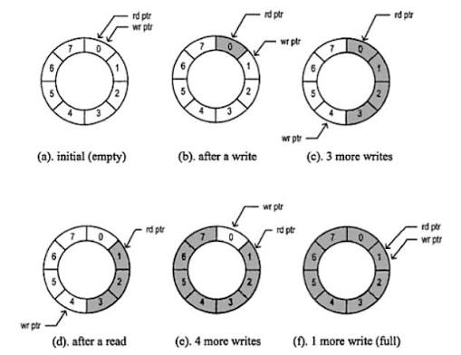

# Опашка

Опашката е следващата структура от данни, която предстои да разгледаме. При нея, обратно на идеята на **стека**, имаме достъп за добавяне в края на опашката (след последния елемент) и премахване на първия елемент.

Този принцип имитира истинска опашка — първият елемент, влязъл в колекцията, е и първият, който ще излезе. Този начин на действие се нарича **First In, First Out** или **FIFO**.

Ползите от опашката са много:

* **Разпределение на задачи** — подаване на задачи към нишки за паралелна обработка, подаване на позиции за изчисление на най-кратък път (A* алгоритъм) и т.н.
* **Подаване на пакети в мрежата.**
* **Обхождане на графи в широчина** — Breadth-First Search (BFS).

## Последователна реализация

Една опашка като структура от данни трябва, на първо място, да включва точно две основни операции:

* **enqueue** — добавяне на елемент в края;
* **dequeue** — премахване на елемента от началото.

Всяка друга операция е незадължителна и единствено помага за употребата на структурата. Единственото важно ограничение е да не позволяваме произволен достъп до елементите, тъй като това би нарушило инварианта на опашката.

Самите имплементации на опашка са много. Те варират от безопасната за паралелно изпълнение [`boost::lockfree::queue`](https://www.boost.org/doc/libs/latest/doc/html/lockfree.html) до семплите статични академични опашки.

Тук ще разгледаме втория тип, за да разберем основната идея.

## Вариант 1

```cpp
class queue {
  ...
private:
  int* data;
  int head, tail;
  int capacity;
};
```

Нека държим нашата опашка като член-данни с два отделни индекса — `head` и `tail`.

* `head` — сочи към елемента, който ще бъде премахнат следващ;
* `tail` — сочи към позицията, на която ще бъде добавен следващият елемент.

Операциите ще изглеждат по следния начин:

**Enqueue**

```cpp
void enqueue(int el)
{
    if (full()) throw "error";

    data[tail] = el;
    tail++;
}
```

**Dequeue**

```cpp
int dequeue()
{
    if (empty()) throw "error";

    int el = data[head];
    head++;

    return el;
}
```

---

### Скрити проблеми

В тази имплементация има два скрити и много сериозни проблема, които трябва да отстраним.

**1. Неизползвано място**

Ако имаме опашка с **4 елемента**, добавим 4 елемента и след това извадим два, ще имаме следното:

```text
| empty | empty |  *  |  *  |
```

Опашката не е пълна, но `tail` вече е достигнал края на масива. Ако пробваме да добавим още един елемент ще достъпим позиция извън масива. Тук идва на помощ **висшата алгебра**. Вместо да си представяме опашката като линеен масив, ще си я представим като **цикличен буфер**.

За целта ще използваме модулния оператор `%`, който ни позволява да върнем индекса обратно в началото на масива, когато достигне `capacity`.

<div align="center">
  
</div>

### Enqueue

```cpp
void enqueue(int el)
{
    if (full()) throw "error";

    data[tail] = el;
    tail = (tail + 1) % capacity;
}
```

### Dequeue

```cpp
int dequeue()
{
    if (empty()) throw "error";

    int el = data[head];
    head = (head + 1) % capacity;

    return el;
}
```

### 2. Как разграничаваме кога опашката е пълна и кога е празна?

След като използваме цикличен буфер, в даден момент можем да получим:

```cpp
head == tail
```

Проблемът е, че това състояние може да означава две различни неща:

* опашката е **празна**;
* опашката е **пълна** и `tail` е обиколил целия буфер и е стигнал до `head`.

Следователно следните проверки не са достатъчни:

```cpp
bool empty() { return head == tail; }
bool full()  { return head == tail; }
```

Тук решението не е толкова просто, тъй като това е слабата страна на точно тази реализация. Едно решение е да се постави булева променлива, която да пази информация за последната операция, когато `head == tail`:

* `op = 1` — последната операция е била добавяне.
* `op = 0` — последната операция е била изваждане.

Така можем да разграничим двете състояния:

```cpp
bool empty() { return head == tail && !op; }
bool full()  { return head == tail &&  op; }
```

Следователно при **enqueue** трябва да актуализираме `op` така, че да показва добавяне, а при **dequeue** — изваждане.

Друг по-нишов вариант е да се използва последния бит на указателя на масива от данни, тъй като при определени архитектури и гаранции за подравняване някои от най-ниските битове на адреса могат да бъдат неизползвани. 

Това е по-сложен вариант, който споменавам за пълнота.

---

## Вариант 2

```cpp
class queue {
  ...
private:
  int* data;
  int head, size;
  int capacity;
};
```

В този вариант няма да използваме два отделни маркера за добавяне и премахване, а ще държим само:

* **Откъде започват данните** — `head`
* **Колко елемента има** — `size`

По този начин винаги можем да изчислим къде да добавим следващия елемент с:

```cpp
(head + size) % capacity
```

Проверката за пълна или празна опашка също става директна:

```cpp
bool empty() { return size == 0; }
bool full()  { return size == capacity; }
```

Този вариант е за предпочитане, тъй е много по-семпъл и лесен за имплементиране!

## Свързана реализация

Свързаната реализация на опашка отново се гради на индиректния принцип за съхраняване на данни, с единствената разлика, че този пък ще имаме два указателя:

* **head** - сочи към първия елемент.
* **tail** - сочи към последния елемент.

## Общи своиства на опашката

* **Добавяне на елемент (enqueue)** - О(1)
  
* **Премахване на елемент (dequeue)** - О(1)
  
* **Итерация** - няма
  
* **Достъп до произволен елемент** - няма
  
* **Локалност** - сравнително добра при последователната реализация, обаче голям размер на данните ще доведе до **cache miss-ове** при скок в паметта.

## Задачи за упражнение 

**1. [Number of Recent Calls](https://leetcode.com/problems/number-of-recent-calls/description/?envType=problem-list-v2&envId=queue)**

**2. [Number of Students Unable to Eat Lunch](https://leetcode.com/problems/number-of-students-unable-to-eat-lunch/description/?envType=problem-list-v2&envId=queue)**

**3. [Time Needed to Buy Tickets](https://leetcode.com/problems/time-needed-to-buy-tickets/description/?envType=problem-list-v2&envId=queue)**

**4. [Dota2 Senate](https://leetcode.com/problems/dota2-senate/description/?envType=problem-list-v2&envId=queue)**


