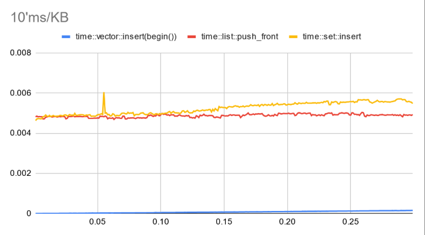
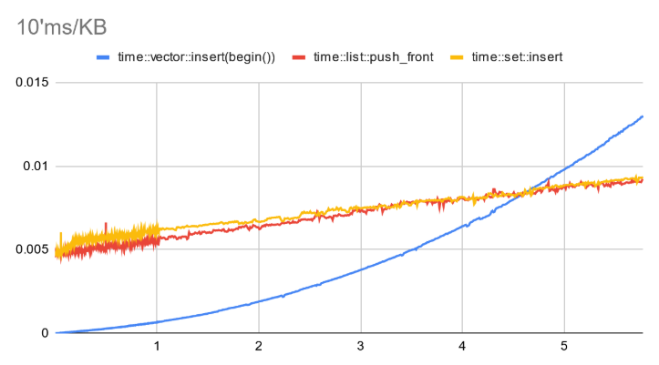
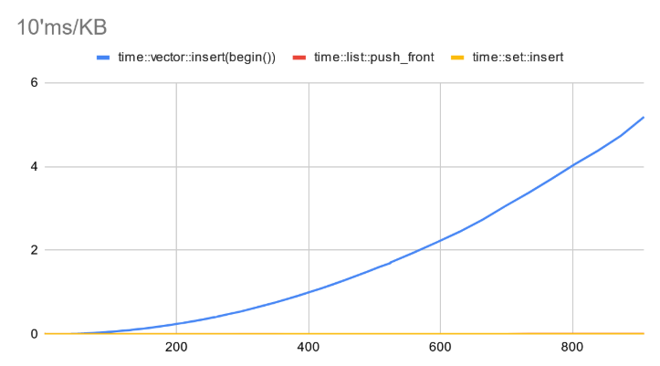
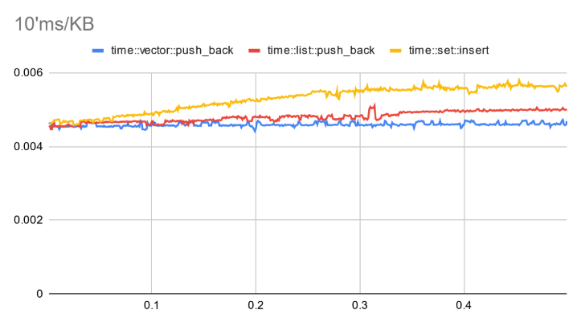
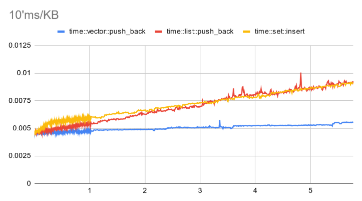
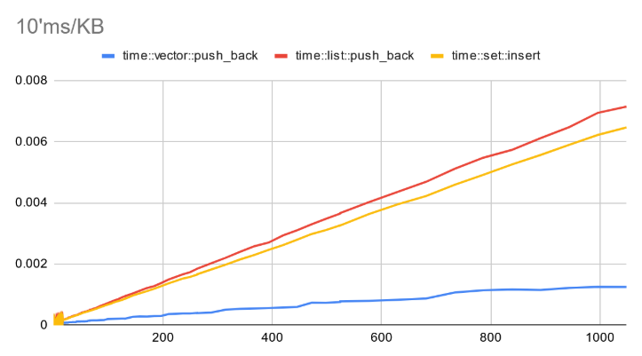

# Плюсове и минуси на динамичния масив

Преди да започнем с това **"що е то списък?"** нека си припомним какво знаем за досега разгледаните линейни структури от данни?

### Добрите страни

* **Последователност в паметта** - ако елемент $i$ се намира на адрес $x$, то елемент $i+1$ се намира на адрес $x + sizeof(T)$.
   
* **Инкесация в константно време**.
   
* **Добра локалност** - елементите са разпределени един след друг.

* **Бърза итерация**.

### Минусите на динамичния масив

Досега разгледахме многото добри качества на динамичния масив, но въпреки това той не е **"супер структура"** и за жалост има своите минуси. 

**Премахване на прозиволен елемент**

Като за начало можем да кажем, че не е много лесно да премахнем елемент на произволна позиция. За целта имаме следните опции:

1. Да поставим елемента на последна позиция върху този, които премахваме. Това води до премахваща операция за константно време, но нарушава правилото масивът да има строго определен ред!

2. Да оставим елемента на мястото му, но да го маркираме като премахнат, това пак води до операция в константно време, но ще имаме нужда от допълнителна памет, за да маркираме елементите и допълнителна логика за проверки при всеки достъп. Като цяло много сложен и безполезен подход.

3. Да отместим елементите с един назад след елемента, който искаме да премахнем. Това е много бърз операция, поради пространствената локалност на масива и опазва реда на елементите. Обаче отнема линейно време в най-лошия случай.

**Memory overhead**

Динамичния масив също така заделя **overhead** памет. Дори един празен std::vector заема някакво количество памет (което е специфично за версията на C++ и системата, която използвате), което понякога не е желан ефект!

**Паралелна обработка**

Още един минус е паралелната обработка с масиви. Ако задачата, върху която работите е **embarrassingly parallel**, което значи че данните, които обработвате са независими и не си пречат при паралелна обработка (пример - rendering), тогава нямате проблеми. Обаче ако просто искате да обработвате паралено масив, ще имате нужда от синхронизация на действията, което означава че една нишка ще работи върху данните и ще възпира останалите, което е ужасно неудобно!

**Ивалидация на итераторите**

При преоразмеряване началната точка на масива в паметта (може да) се променя, което инвалидира итераторите, тъй като всеки адрес се променят.

## Извод

След това кратко обобщение на динамичния масив можем да си направи извода, че той е може би най-добрата структура от данни ако ще добавяме последователно елементи в края и няма да премахваме постояно елементи на произволни позиции. 

Обаче ние няма да спрем до тук. Сега ще разгледаме една структура от данни, която ще реши повечето от недостатъчците на динамичния масив

# Едносвързан списък

Това е следващата линейна структура от данни, която ще разгледаме. Тя прилича много по поведение на свързаната реализация на опашка, която разгледахме в предишното упражнение, но с малко повече **екстри**.

Нека разгледаме с какви операции разполагаме:

## Добаяне

**В началото** - `pushFront()` // $O(1)$

При тази операция силата на свързания списък започва да се проявява при много на брой елементи. На ето тези снимки можете да видите, че докато елементите са малко на брой (до 4 KB) достъпа до L1 кеша успява да компенсира бавната линейна операция, която е pushFront при вектора. Но малко преди 5 KB времето за добавяне на елемент (при теста няма алокация, елементите са предварително заделени) става по-бързо от преместването.

  
  
  

Източник: Любомир Коев

**В края** - `pushBack()` // $O(1)$

Тук вече историята е друга. Колкото и много елементи да поставим, списъкът не може да бие добавянето на елемент в края на масив без алокация на елементи, ако имаше алокация от време на време ще се получават артефакти във времто, но при много елементи това е неглежируемо!

  
  
  

Източник: Любомир Коев

**След итератор/елемент** - `pushAt()` // $O(1)$

Тук резултатът ще бъде същия като при добавяне в началото, тъй като за списъка това е просто обновяване на няколко указателя, а за масива това е преместване на потенциално всички елементи. Усоловието е, че вече имаме итератора, след който добавяме, тъй като обхождането на списък е бавна операция, както предстои да видим. 

## Премахване

**В началото** - `popFront()` // $O(1)$

**След елемент** - `popAfter()` // $O(1)$

**В края** - `popBack()` // $O(n)$

Премахването в края изисква пред последния елемент, за да бъде запазен инварианта на списъка, което означава че тази операция не е характерна за едносвързания списък и я добавяме само за пълнота.

## Достъп до елемент 

**Първи елемент** - front() // $O(1)$

**Последен елемент** - back() // $O(1)$

**Посочен** - at() // $O(n)$ 

Ако се търси конкретен елемент (което е изцяло нехарактерно за свързан списък), тогава сложността е линейна, тъй като трябва да се обходи целият списък и да се намери търсеният елемент.

## Обхождане 

Много е удобно чрез ForwardIterator. Позволява ни паралелен достъп, тъй като обновяване на списък не инвалидира итератора, обаче е също така и бавно, поради постоянните скоци в паметта.

## Сливане 

Може да стане за константно време ако залепим единия списък след другия, иначе е линейно по дължината на двата списъка, тъй като създаваме нов (резултатен списък), които ще върнем.

## Сортиране

Можем да соритраме свързан списък **inplace** (без допълнителна памет), чрез **merge sort** за време $O(n \cdot log(n))$.

## Извод

Нека видим какво точно спечелихме със свързания списък и дали не ви измамих като обещах, че в него се крие решението на проблемите на динамичния масив?

**Ползи**

* Премахване за константно време в началото или след итератор.
* Подлежи на лесна паралелна обработка.
* Сливането на два списъка за константно време.
* Операциите за добавяне са с константна сложност.
* Празният списък заема константна памет, равна на големината на двата указателя, които пази (head, tail).
* Нямаме инвалидация на итераторите при премахване и добавяне на нови елементи. 

**Какво не ни харесва**

* Нямаме премахване в края.
* Липсва индексация.
* Плащаме линейна допълнителна памет, заради указателите ако типа ни е малък по размер.
* Всички действия са в една посока.
* Винаги трябва да имаме предшестващ елемент.

## Практически ползи на свързаните списъци

Свързаните списъци са едни от най-използваните структури от данни поради удобното добавяне и премахване на елементи за константно време.

Ето някои от техните по-популярни приложения:

* Memory allocators — например arena-based алокатори.
* Виртуална памет — абстракция на паметта на компютъра, при която физическата памет може да бъде RAM или вторична памет.
* Кеш предиктори.

## Задачи за упражнение

#### По-лесни задачи за списъци

**Задача 1 - [Merge Two Sorted Lists](https://leetcode.com/problems/merge-two-sorted-lists/description/?envType=problem-list-v2&envId=linked-list)**

**Задача 2 - [Remove Duplicates from Sorted List](https://leetcode.com/problems/remove-duplicates-from-sorted-list/description/?envType=problem-list-v2&envId=linked-list)**

**Задача 3 - [Linked List Cycle](https://leetcode.com/problems/linked-list-cycle/description/?envType=problem-list-v2&envId=linked-list)**

**Задача 4 - [Intersection of Two Linked Lists](https://leetcode.com/problems/intersection-of-two-linked-lists/description/?envType=problem-list-v2&envId=linked-list)**

**Задача 5 - [Remove Linked List Elements](https://leetcode.com/problems/remove-linked-list-elements/description/?envType=problem-list-v2&envId=linked-list)**

**Задача 6 - [Reverse Linked List](https://leetcode.com/problems/reverse-linked-list/description/?envType=problem-list-v2&envId=linked-list)**

**Задача 7 - [Palindrome Linked List](https://leetcode.com/problems/palindrome-linked-list/description/?envType=problem-list-v2&envId=linked-list)**

**Задача 8 - [Middle of the Linked List](https://leetcode.com/problems/middle-of-the-linked-list/description/?envType=problem-list-v2&envId=linked-list)**

**Задача 9 - [Convert Binary Number in a Linked List to Integer](https://leetcode.com/problems/convert-binary-number-in-a-linked-list-to-integer/description/?envType=problem-list-v2&envId=linked-list)**

---

#### Малко по-сложни задачки

**Задача 10 - [Minimum Pair Removal to Sort Array I](https://leetcode.com/problems/minimum-pair-removal-to-sort-array-i/description/?envType=problem-list-v2&envId=linked-list)**

**Задача 11 - [Add Two Numbers](https://leetcode.com/problems/add-two-numbers/description/?envType=problem-list-v2&envId=linked-list)**

**Задача 12 - [Remove Nth Node From End of List](https://leetcode.com/problems/remove-nth-node-from-end-of-list/description/?envType=problem-list-v2&envId=linked-list)**

**Задача 13 - [Remove Duplicates from Sorted List II](https://leetcode.com/problems/remove-duplicates-from-sorted-list-ii/description/?envType=problem-list-v2&envId=linked-list)**

**Задача 14 - [Reverse Linked List II](https://leetcode.com/problems/reverse-linked-list-ii/description/?envType=problem-list-v2&envId=linked-list)**

**Задача 15 - [Rotate List](https://leetcode.com/problems/rotate-list/description/?envType=problem-list-v2&envId=linked-list)**

**Задача 16 - [Sort List](https://leetcode.com/problems/sort-list/description/?envType=problem-list-v2&envId=linked-list)**

**Задача 17 - [Rotate List](https://leetcode.com/problems/rotate-list/description/?envType=problem-list-v2&envId=linked-list)**

**Задача 18 - [Delete Node in a Linked List](https://leetcode.com/problems/delete-node-in-a-linked-list/description/?envType=problem-list-v2&envId=linked-list)**

**Задача 19 - [Odd Even Linked List](https://leetcode.com/problems/odd-even-linked-list/description/?envType=problem-list-v2&envId=linked-list)**

**Задача 20 - [*Split Linked List in Parts](https://leetcode.com/problems/split-linked-list-in-parts/description/?envType=problem-list-v2&envId=linked-list)**

**Задача 21 - [Remove Zero Sum Consecutive Nodes from Linked List](https://leetcode.com/problems/remove-zero-sum-consecutive-nodes-from-linked-list/description/?envType=problem-list-v2&envId=linked-list)**

**Задача 22 - [Merge In Between Linked Lists](https://leetcode.com/problems/merge-in-between-linked-lists/description/?envType=problem-list-v2&envId=linked-list)**

**Задача 23 - [Swapping Nodes in a Linked List](https://leetcode.com/problems/swapping-nodes-in-a-linked-list/description/?envType=problem-list-v2&envId=linked-list)**

**Задача 24 - [Maximum Twin Sum of a Linked List](https://leetcode.com/problems/maximum-twin-sum-of-a-linked-list/description/?envType=problem-list-v2&envId=linked-list)**

**Задача 25 - [Double a Number Represented as a Linked List](https://leetcode.com/problems/double-a-number-represented-as-a-linked-list/description/?envType=problem-list-v2&envId=linked-list)**
 

